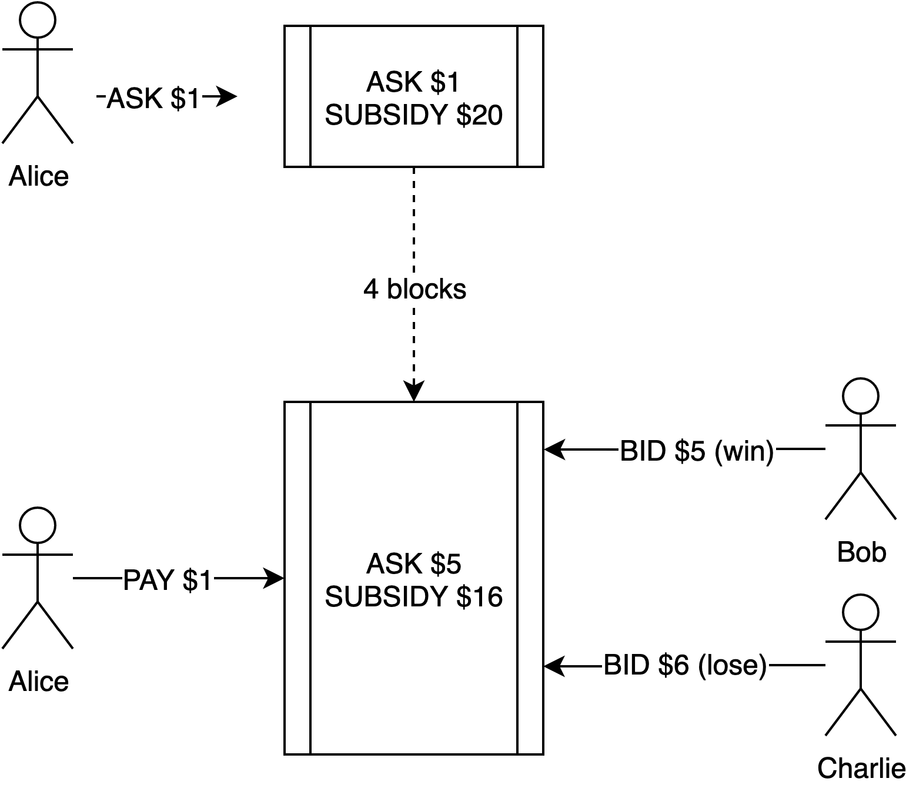
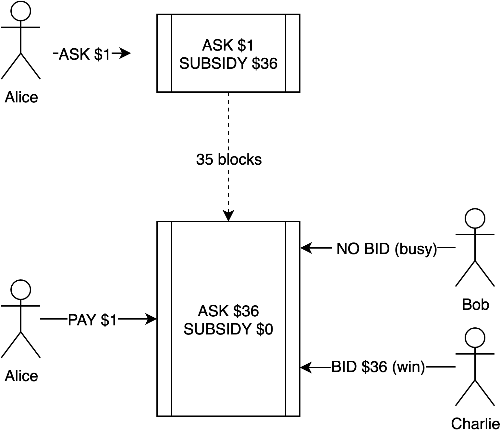

## Summary

Offer an exponential cost reduction (10x-15x the market) as an extremely attractive incentive to tenants by subsidizing using Inflation

## Motivation

The early stages of the Akash market economy need to solve the demand-supply paradox of short-term undersupply to reach market equilibrium and unlock network effects.

## Rationale

To solve the demand-supply paradox, we can use the subsidies from inflation (i.e., borrowing from the future) as described in the framework "[Bootstrapping the Free Market By Borrowing From Future]."

Akash employs an inflation model where a portion of block rewards can be captured by a subsidy pool that is distributed to achieve adoption goals depending on the stage of the network and involves stakeholders performing challenges to claim the subsidy. These subsidy distributions and claim challenges are governed using community proposals that are expected to evolve as the network grows. 

## Parameters

- `SUBSIDY_POOL_RATE`: Percentage of inflation to be captured for subsidies. The proposed rate at Genesis is 50%.

## Specification

In the first phase of Akash, we propose using "exponential cost savings" as the initial subsidy trigger. An exponential cost reduction (10x-15x the market) is an extremely attractive incentive for cloud users where cost remains a top industry priority for three years in a row — particularly to price-sensitive segments such as machine learning and big data.

In this model, the subsidies are distributed periodically based on the Subsidy Distribution Cycle network parameter, which is expected to be daily (or equivalent block periods) at genesis.

As a first step, a tenant asks for a low price and providers that win the bid by offering the lowest price are awarded a bounty. The bounty in the early days may be exponentially high (usually 5x – 6x the cost).

For example, Alice wants to run a machine learning application and it costs her $10 / day today on the cloud. Alice then realizes that she gets 10 times more resources on Akash for the same price and she places a bid for $1 / day on Akash’s marketplace.

Bob and Charlie are cloud providers on Akash. Bob expects to earn $5 / day for running Alice’s Job and Charlie (with a better fill rate) expects to earn $6 / day.  A fill rate is the percent of bids won.

Let’s assume the subsidy pool is at $20 / day. This Order is placed on the order book for $1 / day which receives no bids. From there on, the Ask increments every block period by using the subsidy until a provider fulfills the order or the subsidy pool is exhausted for that distribution cycle. Any unspent subsidy is carried on to the next cycle.

In our example, let’s say after 4 blocks, the Ask reaches $5. Bob bids for $5 and Charlie bids for $6. Bob wins the Job and earns $5 whereas Alice pays $1. The $4 is paid to Bob from the subsidy pool and $16 is carried to the next cycle. 

Alice then posts another order for $1. With the subsidy pool at $20 / day, the pool accumulates to $36. Bob is fully utilized and cannot offer any more compute. Charlie realizes he’s the only one that can fulfill the order and waits until the Ask reaches $36. Charlie now bids on the order and earns $36, 6x what he expected to earn. 

Alice then posts another order for $1. With the subsidy pool at $20 / day, the pool accumulates to $36. Bob is fully utilized and cannot offer any more compute. Charlie realizes he’s the only one that can fulfill the order and waits until the Ask reaches $36. Charlie now bids on the order and earns $36, 6x what he expected to earn. 

Alice happily posts another order for $1. Since the subsidy pool in the previous bid was won by Charlie, the subsidy pool resets to $20. Bob realizes Charlie made $36 and adds more capacity to the network, expecting to take part in the network prosperity. Bob realizes that he’s the only provider and decides to wait until the Ask reaches $20. 

But Alice is so pleased that she can’t help but share her Akash experience with her friends. Now the Ask is at $15. Danny, another provider, hears about this and decides to offer his capacity to Akash and expects to earn $5. He sees an offer for $15 and bids for $15. Danny earns $15. Alice Pays $1.

Akash’s system design ensures that a provider can be at risk of losing a job (and subsidy along with it) if they’re always trying to win the entire subsidy, and encourages providers to employ incremental strategies.

## Bibliography

[Bootstrapping the Free Market By Borrowing From Future]: https://blog.akash.network/2019/10/07/bootstrapping-a-free-market-by-borrowing-from-the-future/

## Copyright

All content herein is licensed under [Apache 2.0](https://www.apache.org/licenses/LICENSE-2.0).
